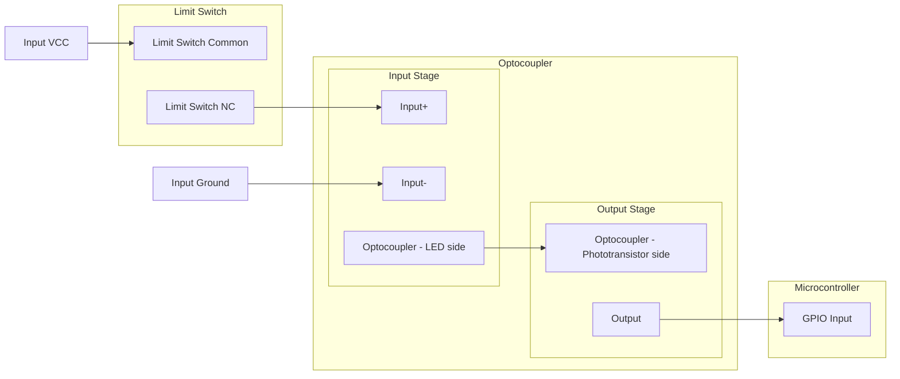

# Circuits

## Limit Switch

With optocoupler

```mermaid
graph LR
    subgraph Optocoupler
        direction LR

        subgraph Input Stage
            Input+
            Input-

            OI
        end

        OI[Optocoupler - LED side] --> OO[Optocoupler - Phototransistor side]

        subgraph Output Stage
            Output
            OO
        end
    end

    subgraph Limit Switch
        LSC[Limit Switch Common]
        LSNC[Limit Switch NC]
    end

    subgraph Microcontroller
        MInput[GPIO Input]
    end
     
    IVCC[Input VCC] --> LSC
    LSNC --> Input+
    IGND[Input Ground] --> Input-
    Output --> MInput
```
