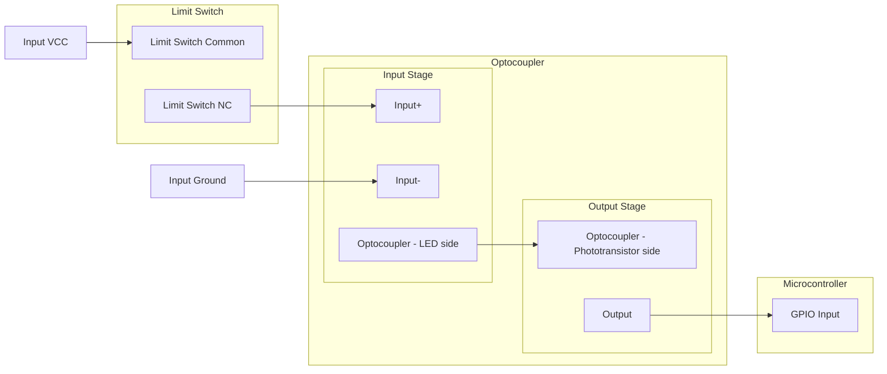
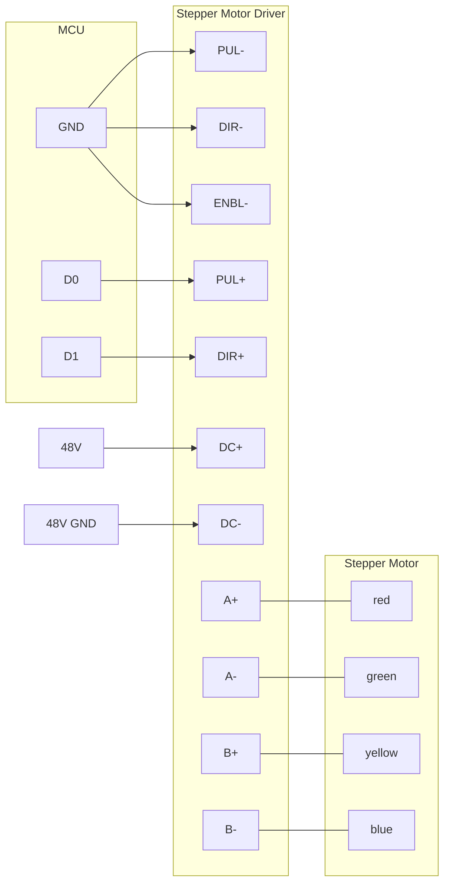

# Circuits

## Limit Switch

With optocoupler

```mermaid
graph LR
    subgraph Optocoupler
        direction LR

        subgraph Input Stage
            Input+
            Input-

            OI
        end

        OI[Optocoupler - LED side] --> OO[Optocoupler - Phototransistor side]

        subgraph Output Stage
            Output
            OO
        end
    end

    subgraph Limit Switch
        LSC[Limit Switch Common]
        LSNC[Limit Switch NC]
    end

    subgraph Microcontroller
        MInput[GPIO Input]
    end
     
    IVCC[Input VCC] --> LSC
    LSNC --> Input+
    IGND[Input Ground] --> Input-
    Output --> MInput
```

## Stepper Motor

```mermaid
graph LR
    subgraph Microcontroller [MCU]
        MCU_GND[GND]
        MCU_D0[D0]
        MCU_D1[D1]
    end

    subgraph Stepper Motor Driver
        DRIVER_PUL+[PUL+]
        DRIVER_PUL-[PUL-]
        DRIVER_DIR+[DIR+]
        DRIVER_DIR-[DIR-]
        DRIVER_ENBL-[ENBL-]
        DRIVER_DC+[DC+]
        DRIVER_DC-[DC-]
        DRIVER_A+[A+]
        DRIVER_A-[A-]
        DRIVER_B+[B+]
        DRIVER_B-[B-]
    end

    subgraph Stepper Motor
        MOTOR_RED[red]
        MOTOR_GREEN[green]
        MOTOR_YELLOW[yellow]
        MOTOR_BLUE[blue]
    end

    MCU_D0--> DRIVER_PUL+[PUL+]
    MCU_GND --> DRIVER_PUL-[PUL-]
    MCU_D1 --> DRIVER_DIR+[DIR+]
    MCU_GND --> DRIVER_DIR-[DIR-]
    MCU_GND --> DRIVER_ENBL-[ENBL-]

    48V_POS[48V] --> DRIVER_DC+[DC+]
    48V_NEG[48V GND] --> DRIVER_DC-[DC-]

    DRIVER_A+[A+] --- MOTOR_RED[red]
    DRIVER_A-[A-] --- MOTOR_GREEN[green]
    DRIVER_B+[B+] --- MOTOR_YELLOW[yellow]
    DRIVER_B-[B-] --- MOTOR_BLUE[blue]
```
